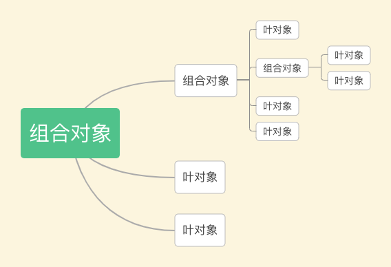

###1.定义

>组合模式就是用小的子对象来构建更大的对象，而这些小的子对象本身也许是由更小的“孙对象”构成的。

###2.核心

又称为部分－整体模式，将对象组合成树形结构以表示“部分整体”的层次结构。组合模式使得用户对单个对象和组合对象的使用具有一致性。



###3.实现

3.1 宏命令 demo-1

目前的万能遥控器，包含了关门、开电脑、登录 QQ 这 3 个命令。现在我们需要一个“超级
万能遥控器”，可以控制家里所有的电器，这个遥控器拥有以下功能：
* 打开空调
* 打开电视和音响
* 关门、开电脑、登录 QQ

```js
// 这是一个组合对象 composite
var MacroCommand = function() {
  return {
    commandsList: [],
    add: function(command) {
      this.commandsList.push(command);
    },
    execute: function() {
      for (var i = 0, command; command = this.commandsList[i++];) {
        command.execute();
      }
    }
  }
};
// 叶对象 leaf
var openAcCommand = {
  execute: function() {
    console.log('打开空调');
  }
};
/**********家里的电视和音响是连接在一起的，所以可以用一个宏命令来组合打开电视和打开音响的命令 *********/
var openTvCommand = {
  execute: function() {
    console.log('打开电视');
  }
};
var openSoundCommand = {
  execute: function() {
    console.log('打开音响');
  }
};
// 组合对象1 -> 打开电视&音响
var macroCommand1 = MacroCommand();
macroCommand1.add(openTvCommand);
macroCommand1.add(openSoundCommand);

/*********关门、打开电脑和打登录 QQ 的命令****************/
var closeDoorCommand = {
  execute: function() {
    console.log('关门');
  }
};
var openPcCommand = {
  execute: function() {
    console.log('开电脑');
  }
};
var openQQCommand = {
  execute: function() {
    console.log('登录 QQ');
  }
};
// 组合对象2 ->关门、开电脑、登QQ
var macroCommand2 = MacroCommand();
macroCommand2.add(closeDoorCommand);
macroCommand2.add(openPcCommand);
macroCommand2.add(openQQCommand);
/*********现在把所有的命令组合成一个“超级命令”**********/
var macroCommand = MacroCommand();
macroCommand.add(openAcCommand);
macroCommand.add(macroCommand1);
macroCommand.add(macroCommand2);

// var macroCommand3 = MacroCommand()
// macroCommand3.add(macroCommand)

/*********最后给遥控器绑定“超级命令”**********/
var setCommand = (function(command) {
  document.getElementById('btn').onclick = function() {
    command.execute();
  }
})(macroCommand);
```

3.2 组合模式的透明性带来的问题

组合模式的透明性使得发起请求的客户不用去顾忌树中组合对象和叶对象的区别，但它们在
本质上有是区别的。
组合对象可以拥有子节点，叶对象下面就没有子节点， 所以我们也许会发生一些误操作，
比如试图往叶对象中添加子节点。解决方案通常是给叶对象也增加 add 方法，并且在调用这个方
法时，抛出一个异常来及时提醒客户:

```js
var MacroCommand = function(){ 
   return { 
     commandsList: [], 
     add: function( command ){ 
       this.commandsList.push( command ); 
     }, 
     execute: function(){ 
       for ( var i = 0, command; command = this.commandsList[ i++ ]; ){ 
          command.execute(); 
       } 
     } 
   } 
}; 
var openTvCommand = { 
   execute: function(){ 
      console.log( '打开电视' ); 
   }, 
   add: function(){
      throw new Error( '叶对象不能添加子节点' ); 
   } 
}; 
var macroCommand = MacroCommand(); 
macroCommand.add( openTvCommand ); 
openTvCommand.add( macroCommand ) // Uncaught Error: 叶对象不能添加子节点
```

3.3 创建HTML DOM demo-2

```js
//composite
class Container {
  constructor(id) {
    this.children = []
    this.element = document.createElement('div')
    this.element.id = id
    this.element.style.border = '1px solid black'
    this.element.style.margin = '10px'
    this.element.classList.add('container')
  }

  add(child) {
    this.children.push(child)
    this.element.appendChild(child.getElement())
  }


  hide() {
    this.children.forEach(node => node.hide())
    this.element.style.display = 'none'
  }

  show() {
    this.children.forEach(node => node.show())
    this.element.style.display = ''
  }

  getElement() {
    return this.element
  }

}
// leaf
class Text {
  constructor(text) {
    this.element = document.createElement('p')
    this.element.innerText = text
  }

  add() {
    throw new Error('I am leaf:))')
  }

  hide() {
    this.element.style.display = 'none'
  }

  show() {
    this.element.style.display = ''
  }

  getElement() {
    return this.element
  }
}

// 建立 header 节点
let header = new Container('header')

// 建立两个叶节点
header.add(new Text('标题'))
header.add(new Text('logo'))
// var text3 = new Text('列表')
// header.add(text3)

let main = new Container('main')
main.add(new Text('这是内容1'))
main.add(new Text('这是内容2'))

let page = new Container('page')
page.add(header)
page.add(main)
page.show()


document.body.appendChild(page.getElement())
```

###4.总结

* 组合模式不是父子关系
  组合模式是一种聚合关系。组合对象都包含了一组叶对象，但是Leaf类并不是Composite的子类。组合对象把请求委托给它所包含的所有叶对象，能够合作的关键是拥有了相同的接口。 
* 对叶对象的操作的一致性
  组合模式除了要求组合对象和叶对象拥有相同的接口之外，还有一个必要条件，就是对一组叶对象的操作必须具有一致性。
* 什么时候使用组合模式
  * 表示对象的部分整体层次结构。组合模式可以方便地构造一棵树来表示对象的部分-整体结构。特别是我们在开发期间不确定这棵树到底存在多少层次的时候。在树的构造最终完成之后，只需要通过请求树的最顶层对象，便能对整棵树做统一的操作。在组合模式中增加和删除树的节点非常方便，并且符合开放-封闭原则。
  * 客户希望统一对待树中的所有对象。组合模式使客户可以忽略组合对象和叶对象的区别，客户在面对这棵树的时候，不用关心当前正在处理的对象是组合对象还是叶对象，也就不用写一堆if、else语句来分别处理它们。组合对象和叶对象会各自做自己正确的事情，这是组合模式最重要的能力。
* 缺点：系统中的每个对象看起来都与其他对象差不多。它们的区别只有在运行的时候会才会显现出来，这会使代码难以理解。此外，如果通过组合模式创建了太多的对象，资源浪费


